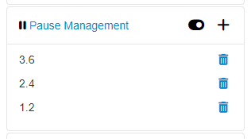
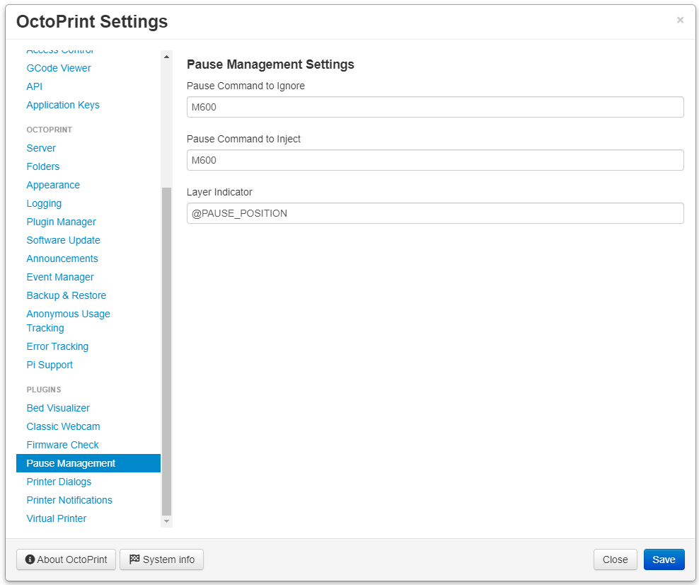
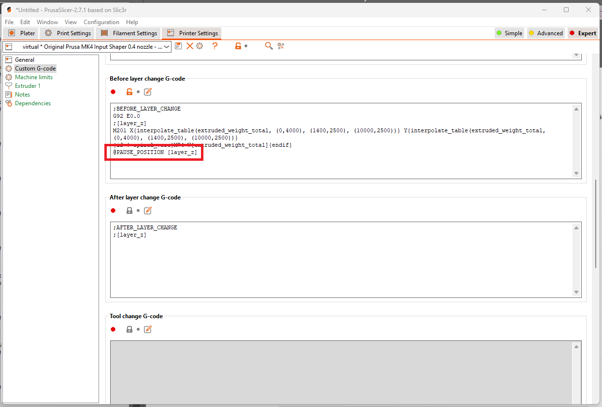

# Pause Management

Plugin allowing to ignore upcoming pauses in gcode or add additional pauses while printing.

## Operation

Use the toggle button in the sidebar to ignore pre-existing configurable pause command, see Settings below.

Use the + button to inject a configurable pause command at provided height or layer number, see Settings section below.

## Settings

- `Pause Command to Ignore`: Configure this setting to match the pause command used by your slicer. This is what will be ignored when the toggle button in the sidebar is enabled.
- `Pause Command to Inject`: Configure this setting as the pause command that you want to send at given pause positions in the sidebar.
- `Layer Indicator`: Configure this setting to match the custom command added to your slicer to let the plugin know what height or layer number the print is at. This is used to match against the pause positions added in the sidebar. See the Slicer Setup section below for more details.

## Slicer Setup

In order for the injection of pause commands to work a configurable layer indicator needs to be added to your slicer's before layer change gcode script.

### PrusaSlicer

For PrusaSlicer that setting can be found in Printer Settings > Custom G-code. You have a couple of options to use based on how you want to enter pause positions in the sidebar.

- **Height**: `@PAUSE_POSITION [layer_z]`
- **Layer Number**: `@PAUSE_POSITION [layer_num]`

### Cura

Thanks to [@CortezSMz](https://github.com/CortezSMz) for this information, setup in Cura will require the Search and Replace post-processing script with the following settings.

- Search: `\;LAYER\:(\d+)`
- Replace: `;LAYER:\1\n@PAUSE_POSITION \1`
- Use Regular Expressions: _must_ be checked.

---

## Get Help

If you experience issues with this plugin or need assistance please use the issue tracker by clicking issues above.

## Additional Plugins

Check out my other plugins [here](https://plugins.octoprint.org/by_author/#jneilliii)

---

## Sponsors
- Andreas Lindermayr
- [@TheTuxKeeper](https://github.com/thetuxkeeper)
- [@tideline3d](https://github.com/tideline3d/)
- [SimplyPrint](https://simplyprint.io/)
- [Andrew Beeman](https://github.com/Kiendeleo)
- [Calanish](https://github.com/calanish)
- [Lachlan Bell](https://lachy.io/)
- [Jonny Bergdahl](https://github.com/bergdahl)
## Support My Efforts
I, jneilliii, programmed this plugin for fun and do my best effort to support those that have issues with it, please return the favor and leave me a tip or become a Patron if you find this plugin helpful and want me to continue future development.

 

